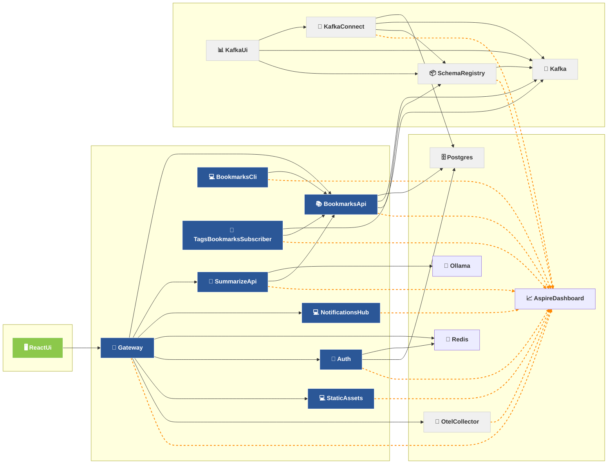

# Running with Aspire

## Prerequisites

1. **.NET 10 SDK**
2. **Aspire CLI**
   ```shell
   dotnet tool install -g Aspire.Cli
   ```
   (or `curl -sSL https://aspire.dev/install.sh | bash`)
3. **Docker** — required, the AppHost starts the Kafka/Postgres/Redis/etc. containers from `compose.yml` via `AddDockerComposeEnvironment`.
4. **Node.js / npm** — required for the React UI (`src/services/bookmarks-react-ui`), which the AppHost runs as a Vite app.
5. **Ollama** — `SummarizeApi` talks to Ollama; make sure it's running (or run `ollama_port_forward` on the host).

## Setup

The `aspire` folder is a **git submodule** (`https://github.com/cezn/aspire.git`) containing the custom `Cezn.Aspire.Hosting.*` packages. A plain `git clone` leaves it empty, which breaks `dotnet restore`/build with `MSB3202: project file ... was not found`. Initialize it first:

```shell
git submodule update --init --recursive
```

Then restore the packages and the local .NET tools (defined in `.config/dotnet-tools.json`, e.g. `grate`, `dotnet-ef`):

```shell
dotnet restore
dotnet tool restore
```

## Run

From the repo root:

```shell
aspire start
```

`aspire start` auto-detects the `AppHost` project and launches the whole distributed app (all .NET services + the Docker Compose containers + the Aspire dashboard).

> Use `aspire start` — **not** `dotnet run` on the AppHost.

You can then open dashboard and use links available on each resource.
Use 'gateway' link to open webapp.
If there are problems, ensure are resources are either started/finished.
After registration, confirmation email is sent to 'mailhog' also available via Aspire dashboard.
You can also use 'auth' resource command on Aspire dashboard to seed user without registration. Credentials will appear in the success model after few seconds.
Note, Kafka related services are the slowest to start, and unfortunately they are needed because api uses protobuf schemas from Schema Registry which itself depends on Kafka for storage. Ugly dependency and I'm planning to loosen it in the future. Otherwise, it would only block tags stats calculation.
If you use remote ssh host/WSL or any kind of remote development tool with VS Code, ports are not automatically forwarded when url is clicked on the dashboard (like they do in the terminal). They must be forwarded manually.

## Run tests

Initially, I was running everything with docker-compose. I've migrated services to Aspire, but tests are still relying on ports from compose files. But if needed, there are bunch of [VS Code tasks](.vscode/tasks.json) to start everything. For example, to run BookmarksApi.Tests, run these tasks (`ctrl+shift+t` in VS Code):

1. Docker Compose Up
2. BookmarksApi: Migrate DB
3. `dotnet run --project  tests/services/BookmarksApi.Tests/`


