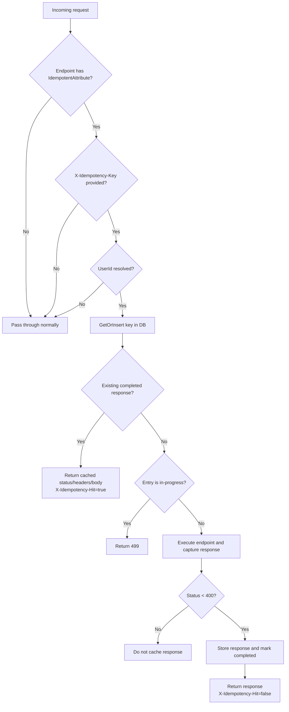
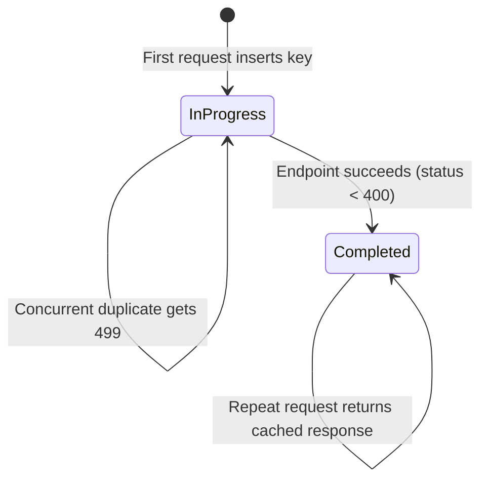

# Idempotency

This folder contains the API idempotency implementation used by `BookmarksApi` to make selected write endpoints safe for client retries.

The implementation ensures that repeated requests with the same idempotency key return the same response (for the same user and operation), instead of executing the operation multiple times.

## Why this exists

Network retries, client timeouts, and duplicate submissions can cause the same mutation request to be sent more than once.

Idempotency prevents duplicate side effects by:

- Registering a request key before running the endpoint
- Returning a cached response when the same request is repeated
- Detecting currently in-flight duplicates

## Components

- `IdempotentAttribute.cs`
  - Endpoint metadata marker. Only endpoints with this metadata are idempotency-aware.
- `IdempotencyMiddleware.cs`
  - Core request pipeline logic.
  - Extracts idempotency key + user identity.
  - Handles cache hit / in-progress / first-time execution paths.
  - Captures successful responses and persists them.
- `IdempotencyDbConnectionExtensions.cs`
  - PostgreSQL read/write operations for `idempotency_keys`.
  - Upsert/check entry and store completed response.

## Where it is enabled

`Program.cs` adds middleware globally:

```csharp
app.UseMiddleware<IdempotencyMiddleware>();
```

Idempotency is active only on endpoints marked with `IdempotentAttribute`, for example in tag bulk operations.

## Request flow



## Keying strategy

A response is uniquely identified by:

- `idempotency_key` (from `X-Idempotency-Key` header)
- `user_id` (resolved by `UserIdProvider`)
- `operation_name` (endpoint display name, fallback: `METHOD PATH`)

This means the same key can be reused safely across:

- Different users
- Different operations/endpoints

## State model



## Database schema

Migration: `migrations/up/008-idempotency-keys.sql`

Main fields:

- `status`: `in-progress` or `completed`
- `response_status_code`, `response_headers`, `response_body`: cached HTTP response payload
- `expires_at`: default now + 24h (for TTL/cleanup policies)
- Primary key: (`idempotency_key`, `user_id`, `operation_name`)

## How to use

1. Mark a mutation endpoint with idempotency metadata:

```csharp
app.MapPost("/api/example", Handler)
   .WithMetadata(new IdempotentAttribute());
```

2. Send `X-Idempotency-Key` from the client for retry-safe requests.

3. Keep the key stable across retries of the same logical operation.

4. Authenticate the request so user identity can be resolved.

## Authentication and user resolution

`UserIdProvider` supports:

- `ApiKey` scheme: user id read from `X-UserId` header
- `Bearer` scheme: user id read from claims (`GetUserId()`)

If user id cannot be resolved, middleware logs warning and bypasses idempotency.

## Response behavior summary

- First successful execution: endpoint runs normally, response cached, `X-Idempotency-Hit: false`
- Duplicate after completion: cached response returned, `X-Idempotency-Hit: true`
- Duplicate while first is still running: returns `499`
- Error responses (`status >= 400`): not cached
- `204 No Content`: no body written

## Operational notes

- The middleware runs in a DB transaction and stores response only after successful endpoint execution.
- Cached headers exclude `Content-Length` and `Transfer-Encoding` (these are handled by ASP.NET Core).
- `expires_at` is indexed; cleanup/retention should be handled by a scheduled job or maintenance routine.

## Example client retry pattern

Use the same idempotency key for retries:

```bash
curl -X POST "http://localhost:5000/api/tags/bulk/add" \
  -H "Authorization: ApiKey ..." \
  -H "X-UserId: user-123" \
  -H "X-Idempotency-Key: 7f4f9f62-0ea6-4f66-a5ac-0e5ab00d9b44" \
  -H "Content-Type: application/json" \
  -d '{"tagNames":["csharp","postgres"]}'
```

If the client retries with the same key, the API returns the original cached response instead of re-applying the mutation.
