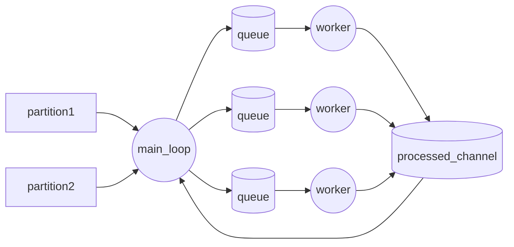

## Expected Kafka headers

- `type` (required): UTF-8 string used to route the message to a registered handler.
  - Must match the `type` used in `kafka.Handle(topic, type, handler)`.
  - If missing or empty, the message is skipped.
- `traceparent` (optional): W3C trace context header used to continue distributed tracing.
- Any custom header used by handler parameters marked with `[FromKafkaHeader]`.
  - Header values are read as UTF-8 strings.
  - Example: handler parameter `[FromKafkaHeader] string id` expects an `id` header.

## Message format

KafkaConsumerApp consumes messages as:

- Key: `string`
- Value: `byte[]` containing a **protobuf-serialized payload** (not JSON)
- Headers: Kafka headers as key/value pairs (key: string, value: bytes interpreted as UTF-8 for header-bound parameters)

The first handler parameter determines the protobuf message type used for deserialization:

- `async (MyProtobufEvent eventMessage, ...) => ...`

So producers should publish records with:

1. Topic matching a configured `kafka.Handle(topic, type, handler)` registration.
2. Header `type` matching that registration's `type` value.
3. `value` serialized as protobuf bytes for the handler's first parameter type.
4. Any additional headers required by `[FromKafkaHeader]` parameters.

## DLQ and user blocking

DLQ-specific services are encapsulated under `Dlq/` and registered via an internal module entrypoint (`AddKafkaConsumerDlq`) that is invoked by `AddKafkaConsumerApp`.

When `Kafka:Dlq:Enabled` is `true`, KafkaConsumerApp applies dead-letter semantics:

- If processing fails, the original message is copied to the DLQ topic configured in `Kafka:Dlq:Topic`.
- If the message key (`UserId`) is present, user state is marked as blocked in `Kafka:Dlq:BlockedUsersTopic`.
- While a user is blocked, new messages for that key are sent directly to DLQ and the main topic offset is stored.
- If DLQ/state publishing fails, KafkaConsumerApp seeks and retries the original message (to avoid silent loss).
- A message with header `x-dlq-replay=true` that is processed successfully unblocks that user.

### Required configuration

```json
{
  "Kafka": {
    "Dlq": {
      "Enabled": true,
      "Topic": "outbox.event.Bookmark.dlq",
      "BlockedUsersTopic": "bookmark.users.blocked",
      "ReplayHeaderName": "x-dlq-replay",
      "ReplayHeaderValue": "true"
    }
  }
}
```

### Example envelope

```text
topic: outbox.event.Bookmark
key: "bookmark-123"
headers:
  type: "bookmark_created"
  id: "9f7c0d0d-2ecf-4c48-9b54-0ee6f4f3d9d8"
  traceparent: "00-4bf92f3577b34da6a3ce929d0e0e4736-00f067aa0ba902b7-01"
value: <protobuf bytes for Bookmarks.BookmarkCreated>
```
